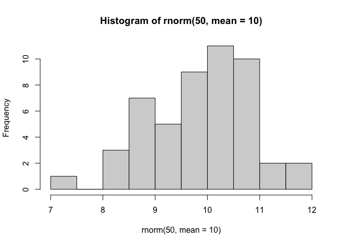
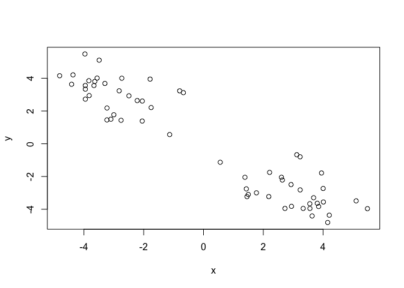
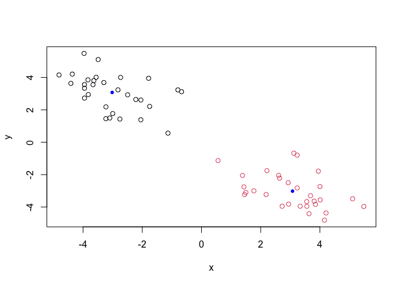
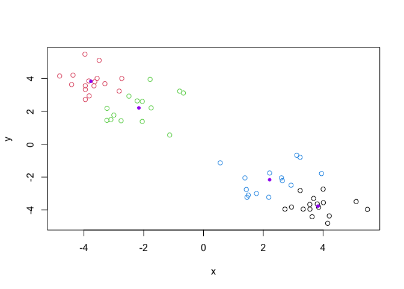
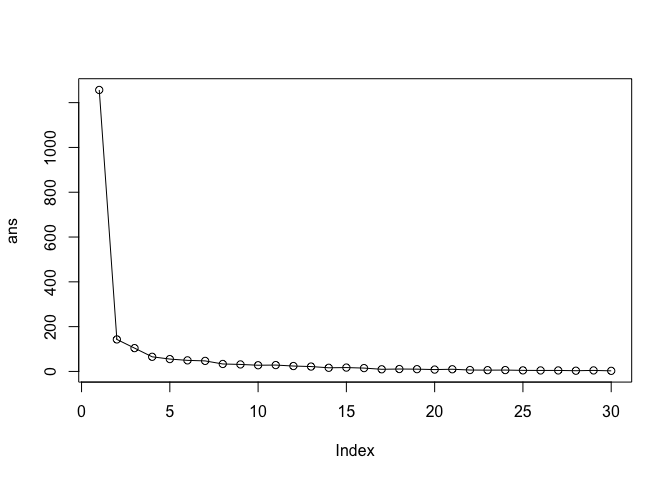
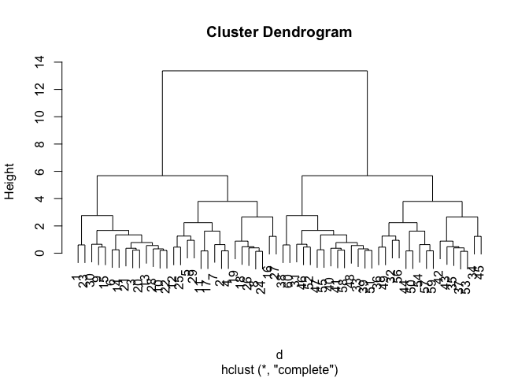
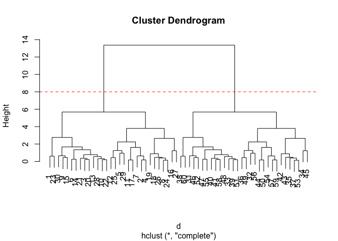
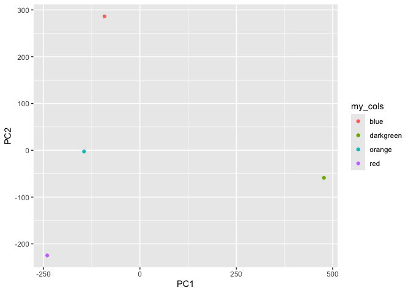

# Class 7: Machine Learning 1
Nathan Joseph (PID: A17668656)

- [Background](#background)
- [K-means clustering](#k-means-clustering)
- [Hierarchical Clustering](#hierarchical-clustering)
- [PCA of UK food data](#pca-of-uk-food-data)
  - [Spotting major differences and
    trends](#spotting-major-differences-and-trends)
  - [Pairs plots and heatmaps](#pairs-plots-and-heatmaps)
- [PCA to the rescue](#pca-to-the-rescue)

## Background

Today we will begin our exploration of some important machine learning
methods, namely **clustering** and **dimensionality reduction**.

Let’s make up some input data for clustering for we know what the
natural “clusters” are.

The function `rnorm()` can be useful here..

``` r
hist(rnorm(50, mean=10))
```



> Q. Generate 30 random numbers centered at +3 and another 30 centered
> at -3

``` r
tmp <- c(rnorm(30, mean=3), rnorm(30, mean=-3))

x<-cbind(x=tmp, y=rev(tmp)) # columwise binding

plot(x)
```



## K-means clustering

The main function in “base R” for K-means clustering is called
`kmeans()`:

``` r
km <- kmeans(x, centers=2)
```

> Q. What component of the results object details the cluster sizes?

``` r
km$size
```

    [1] 30 30

> Q. What component of the results object details the cluster centers?

``` r
km$centers
```

              x         y
    1 -3.017727  3.075124
    2  3.075124 -3.017727

> Q. What component of the results object details the cluster membership
> vectors (i.e. our main result of which points lie in which cluster)?

``` r
km$cluster
```

     [1] 2 2 2 2 2 2 2 2 2 2 2 2 2 2 2 2 2 2 2 2 2 2 2 2 2 2 2 2 2 2 1 1 1 1 1 1 1 1
    [39] 1 1 1 1 1 1 1 1 1 1 1 1 1 1 1 1 1 1 1 1 1 1

> Q. Plot our clustering results with points colored by cluster and also
> add the cluster centers as new points colored in blue?

``` r
plot(x, col=c(km$cluster))
points(km$centers, col='blue', pch=20)
```



> Q. Run `kmeans()` again and this time produce 4 clusters (call your
> result object `k4`) and make a results figure like above?

``` r
k4 <- kmeans(x, 4)
plot(x, col=k4$cluster)
points(k4$centers, col='purple', pch=20)
```



The metric

``` r
km$tot.withinss
```

    [1] 142.9157

``` r
k4$tot.withinss
```

    [1] 65.32268

> Q. Let’s try different number of K (centers) from 1 to 30 and see what
> the best result is?

``` r
ans <- NULL
for (i in 1:30) {
  ans <- c(ans, kmeans(x, centers = i)$tot.withinss)
}
ans
```

     [1] 1256.600596  142.915737  104.119210   65.322682   55.211657   49.464787
     [7]   46.987436   33.306320   31.262299   27.687448   28.434716   24.095535
    [13]   21.781354   16.283777   17.252460   14.952027    9.580898   10.763925
    [19]   10.158740    8.303193    9.744986    6.292380    5.706726    6.093268
    [25]    4.741247    4.419282    4.485899    3.177180    4.545444    2.631722

``` r
plot(ans, typ="o")
```



Note: Although it is possible to cluster up to 60 centers, it isn’t
optimal since the elbow or knee point is at 2 which is the optimal k for
clustering.

**Key-point:** K-means will impose a clustering structure on your data
even if it is not there - it will always give you the answer you asked
for even if that answer is silly!

## Hierarchical Clustering

The main function of Hierarchical Clustering is called `hclust()`.
Unlike `kmeans()` (which does all the work for you) you can’t just pass
`hclust()` our raw input data. It needs a “distance matrix” like the one
returned from the `dist()` function.

``` r
d<-dist(x)
hc<-hclust(d)
plot(hc)
```



To extract our cluster membership vector from a `hclust` result object
we have to “cut” our tree at a given height to yield separate
“groups”/“branches”.

``` r
plot(hc)
abline(h=8, col='red', lty=2)
```



To do this we use the `cutree()` function on our `hclust()` object:

``` r
groups <- cutree(hc, h=8)
groups
```

     [1] 1 1 1 1 1 1 1 1 1 1 1 1 1 1 1 1 1 1 1 1 1 1 1 1 1 1 1 1 1 1 2 2 2 2 2 2 2 2
    [39] 2 2 2 2 2 2 2 2 2 2 2 2 2 2 2 2 2 2 2 2 2 2

``` r
table(groups, km$cluster)
```

          
    groups  1  2
         1  0 30
         2 30  0

## PCA of UK food data

Import the dataset of food consumption in the UK:

``` r
url <- "https://tinyurl.com/UK-foods"
x <- read.csv(url)
x
```

                         X England Wales Scotland N.Ireland
    1               Cheese     105   103      103        66
    2        Carcass_meat      245   227      242       267
    3          Other_meat      685   803      750       586
    4                 Fish     147   160      122        93
    5       Fats_and_oils      193   235      184       209
    6               Sugars     156   175      147       139
    7      Fresh_potatoes      720   874      566      1033
    8           Fresh_Veg      253   265      171       143
    9           Other_Veg      488   570      418       355
    10 Processed_potatoes      198   203      220       187
    11      Processed_Veg      360   365      337       334
    12        Fresh_fruit     1102  1137      957       674
    13            Cereals     1472  1582     1462      1494
    14           Beverages      57    73       53        47
    15        Soft_drinks     1374  1256     1572      1506
    16   Alcoholic_drinks      375   475      458       135
    17      Confectionery       54    64       62        41

> Q1. How many rows and columns are in your new data frame named x? What
> R functions could you use to answer this questions?

``` r
nrow(x)
```

    [1] 17

One solution to set the row names is to do it by hand…

``` r
rownames(x) <- x[,1]
x
```

                                          X England Wales Scotland N.Ireland
    Cheese                           Cheese     105   103      103        66
    Carcass_meat              Carcass_meat      245   227      242       267
    Other_meat                  Other_meat      685   803      750       586
    Fish                               Fish     147   160      122        93
    Fats_and_oils            Fats_and_oils      193   235      184       209
    Sugars                           Sugars     156   175      147       139
    Fresh_potatoes          Fresh_potatoes      720   874      566      1033
    Fresh_Veg                    Fresh_Veg      253   265      171       143
    Other_Veg                    Other_Veg      488   570      418       355
    Processed_potatoes  Processed_potatoes      198   203      220       187
    Processed_Veg            Processed_Veg      360   365      337       334
    Fresh_fruit                Fresh_fruit     1102  1137      957       674
    Cereals                        Cereals     1472  1582     1462      1494
    Beverages                     Beverages      57    73       53        47
    Soft_drinks                Soft_drinks     1374  1256     1572      1506
    Alcoholic_drinks      Alcoholic_drinks      375   475      458       135
    Confectionery            Confectionery       54    64       62        41

To remove the first column, I can use the minus index trick

``` r
x <- x[,-1]
x
```

                        England Wales Scotland N.Ireland
    Cheese                  105   103      103        66
    Carcass_meat            245   227      242       267
    Other_meat              685   803      750       586
    Fish                    147   160      122        93
    Fats_and_oils           193   235      184       209
    Sugars                  156   175      147       139
    Fresh_potatoes          720   874      566      1033
    Fresh_Veg               253   265      171       143
    Other_Veg               488   570      418       355
    Processed_potatoes      198   203      220       187
    Processed_Veg           360   365      337       334
    Fresh_fruit            1102  1137      957       674
    Cereals                1472  1582     1462      1494
    Beverages                57    73       53        47
    Soft_drinks            1374  1256     1572      1506
    Alcoholic_drinks        375   475      458       135
    Confectionery            54    64       62        41

A better way to do this is to set the row names to the first column with
`read.csv()`

``` r
x <-read.csv(url, row.names=1)
x
```

                        England Wales Scotland N.Ireland
    Cheese                  105   103      103        66
    Carcass_meat            245   227      242       267
    Other_meat              685   803      750       586
    Fish                    147   160      122        93
    Fats_and_oils           193   235      184       209
    Sugars                  156   175      147       139
    Fresh_potatoes          720   874      566      1033
    Fresh_Veg               253   265      171       143
    Other_Veg               488   570      418       355
    Processed_potatoes      198   203      220       187
    Processed_Veg           360   365      337       334
    Fresh_fruit            1102  1137      957       674
    Cereals                1472  1582     1462      1494
    Beverages                57    73       53        47
    Soft_drinks            1374  1256     1572      1506
    Alcoholic_drinks        375   475      458       135
    Confectionery            54    64       62        41

> Q2. Which approach to solving the ‘row-names problem’ mentioned above
> do you prefer and why? Is one approach more robust than another under
> certain circumstances?

I prefer the second way since it is more robust and it will not
interfere with my future analysis with this dataset.

### Spotting major differences and trends

Is difficult even in this wee 17D dataset…

``` r
barplot(as.matrix(x), beside=T, col=rainbow(nrow(x)))
```


``` r
barplot(as.matrix(x), beside=F, col=rainbow(nrow(x)))
```


### Pairs plots and heatmaps

> Q5: We can use the pairs() function to generate all pairwise plots for
> our countries. Can you make sense of the following code and resulting
> figure? What does it mean if a given point lies on the diagonal for a
> given plot?

If a given point is on the diagonal then the two categories are the same
for the 2 countries in the plot.

``` r
pairs(x, col=rainbow(nrow(x)), pch=16)
```


``` r
library(pheatmap)
```

``` r
pheatmap( as.matrix(x) )
```


## PCA to the rescue

The main PCA function in “base R” is called `prcomp()`. This function
wants the transpose of our food data as input (i.e. the food as columns
and the countries as rows).

``` r
pca <- prcomp(t(x))
```

``` r
summary(pca)
```

    Importance of components:
                                PC1      PC2      PC3     PC4
    Standard deviation     324.1502 212.7478 73.87622 2.7e-14
    Proportion of Variance   0.6744   0.2905  0.03503 0.0e+00
    Cumulative Proportion    0.6744   0.9650  1.00000 1.0e+00

``` r
attributes(pca)
```

    $names
    [1] "sdev"     "rotation" "center"   "scale"    "x"       

    $class
    [1] "prcomp"

To make one of main PCA result figures we turn to `pca$x` the scores
along our new PCs. This is called “PC plot” or “score plot” or
“Ordination plot” …

``` r
my_cols <- c("orange", "red", "blue", "darkgreen")
```

``` r
library(ggplot2)
ggplot(pca$x) +
  aes(PC1, PC2, col=my_cols) +
  geom_point()
```



The second major result figure is called a “loadings plot” of “variable
contributions plot” or “weight plot”.

``` r
ggplot(pca$rotation) +
  aes(PC1, rownames(pca$rotation)) +
  geom_col()
```


