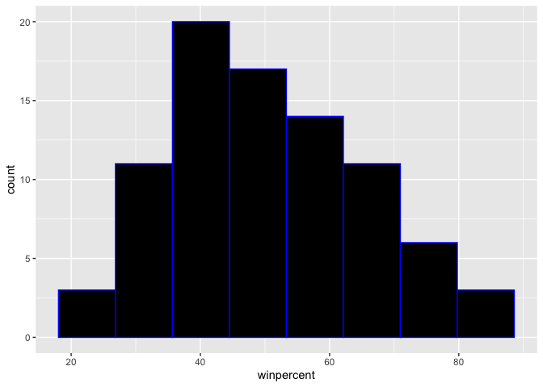
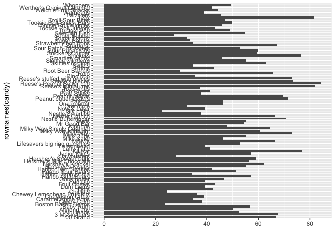
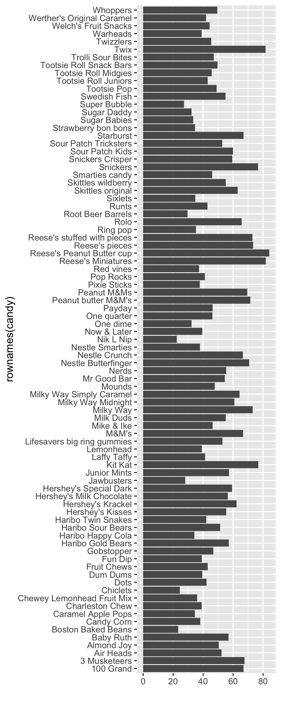
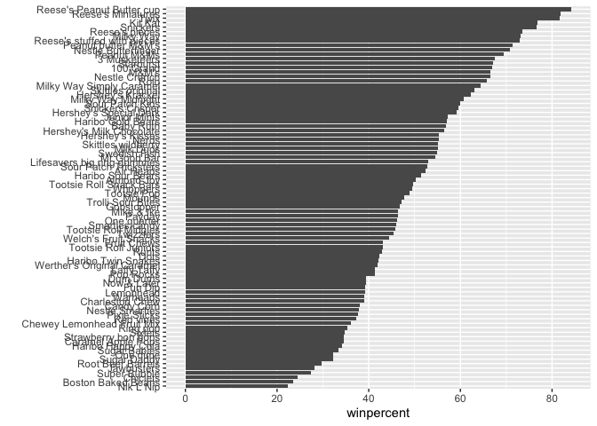
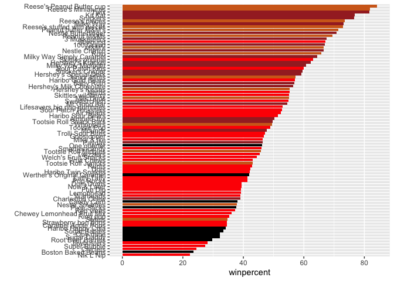
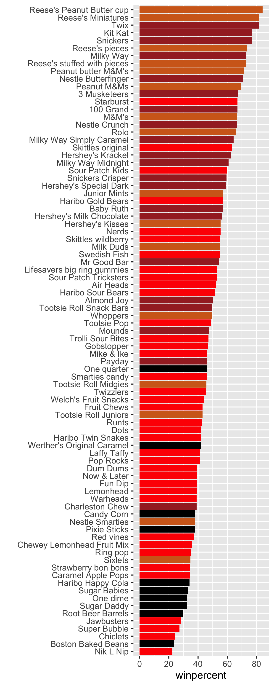
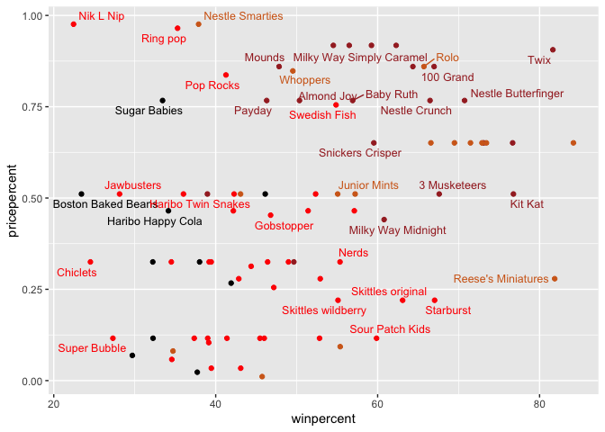
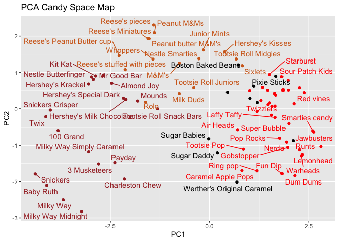
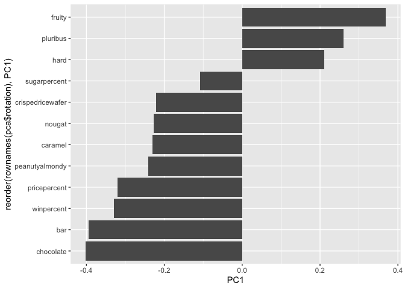

# class09: Halloween Candy Mini-Project
Nathan Joseph (PID: A17668656)

- [Background](#background)
- [Data Import](#data-import)
- [Exploring the correlation
  structure](#exploring-the-correlation-structure)

## Background

In today’s mini-project we will analyze candy data with ggplot, basic
statistics, correlation analysis, and principal component analysis
methods we have been learning thus far.

## Data Import

This data comes as a CSV file from the 538 website:

``` r
candy_file <- "candy-data.csv"

candy = read.csv(candy_file, row.names=1)
head(candy)
```

                 chocolate fruity caramel peanutyalmondy nougat crispedricewafer
    100 Grand            1      0       1              0      0                1
    3 Musketeers         1      0       0              0      1                0
    One dime             0      0       0              0      0                0
    One quarter          0      0       0              0      0                0
    Air Heads            0      1       0              0      0                0
    Almond Joy           1      0       0              1      0                0
                 hard bar pluribus sugarpercent pricepercent winpercent
    100 Grand       0   1        0        0.732        0.860   66.97173
    3 Musketeers    0   1        0        0.604        0.511   67.60294
    One dime        0   0        0        0.011        0.116   32.26109
    One quarter     0   0        0        0.011        0.511   46.11650
    Air Heads       0   0        0        0.906        0.511   52.34146
    Almond Joy      0   1        0        0.465        0.767   50.34755

> Q1. How many different candy types are in this dataset?

``` r
nrow(candy)
```

    [1] 85

There are 85 different candy types in this dataset.

> Q2. How many fruity candy types are in the dataset?

``` r
sum(candy[,"fruity"])
```

    [1] 38

There are 38 fruity candy types in the candy dataset.

> Q3. What is your favorite candy (other than Twix) in the dataset and
> what is it’s winpercent value?

``` r
candy["Almond Joy",]$winpercent
```

    [1] 50.34755

My favorite candy of Almond Joy in this dataset has a win percent of
50.34755.

> Q4. What is the winpercent value for “Kit Kat”?

``` r
candy["Kit Kat",]$winpercent
```

    [1] 76.7686

My favorite candy of Kit Kat in this dataset has a win percent of
76.7686.

> Q5. What is the winpercent value for “Tootsie Roll Snack Bars”?

``` r
candy["Tootsie Roll Snack Bars",]$winpercent
```

    [1] 49.6535

My favorite candy of Kit Kat in this dataset has a win percent of
49.6535.

``` r
library("skimr")
skim(candy)
```

|                                                  |       |
|:-------------------------------------------------|:------|
| Name                                             | candy |
| Number of rows                                   | 85    |
| Number of columns                                | 12    |
| \_\_\_\_\_\_\_\_\_\_\_\_\_\_\_\_\_\_\_\_\_\_\_   |       |
| Column type frequency:                           |       |
| numeric                                          | 12    |
| \_\_\_\_\_\_\_\_\_\_\_\_\_\_\_\_\_\_\_\_\_\_\_\_ |       |
| Group variables                                  | None  |

Data summary

**Variable type: numeric**

| skim_variable | n_missing | complete_rate | mean | sd | p0 | p25 | p50 | p75 | p100 | hist |
|:---|---:|---:|---:|---:|---:|---:|---:|---:|---:|:---|
| chocolate | 0 | 1 | 0.44 | 0.50 | 0.00 | 0.00 | 0.00 | 1.00 | 1.00 | ▇▁▁▁▆ |
| fruity | 0 | 1 | 0.45 | 0.50 | 0.00 | 0.00 | 0.00 | 1.00 | 1.00 | ▇▁▁▁▆ |
| caramel | 0 | 1 | 0.16 | 0.37 | 0.00 | 0.00 | 0.00 | 0.00 | 1.00 | ▇▁▁▁▂ |
| peanutyalmondy | 0 | 1 | 0.16 | 0.37 | 0.00 | 0.00 | 0.00 | 0.00 | 1.00 | ▇▁▁▁▂ |
| nougat | 0 | 1 | 0.08 | 0.28 | 0.00 | 0.00 | 0.00 | 0.00 | 1.00 | ▇▁▁▁▁ |
| crispedricewafer | 0 | 1 | 0.08 | 0.28 | 0.00 | 0.00 | 0.00 | 0.00 | 1.00 | ▇▁▁▁▁ |
| hard | 0 | 1 | 0.18 | 0.38 | 0.00 | 0.00 | 0.00 | 0.00 | 1.00 | ▇▁▁▁▂ |
| bar | 0 | 1 | 0.25 | 0.43 | 0.00 | 0.00 | 0.00 | 0.00 | 1.00 | ▇▁▁▁▂ |
| pluribus | 0 | 1 | 0.52 | 0.50 | 0.00 | 0.00 | 1.00 | 1.00 | 1.00 | ▇▁▁▁▇ |
| sugarpercent | 0 | 1 | 0.48 | 0.28 | 0.01 | 0.22 | 0.47 | 0.73 | 0.99 | ▇▇▇▇▆ |
| pricepercent | 0 | 1 | 0.47 | 0.29 | 0.01 | 0.26 | 0.47 | 0.65 | 0.98 | ▇▇▇▇▆ |
| winpercent | 0 | 1 | 50.32 | 14.71 | 22.45 | 39.14 | 47.83 | 59.86 | 84.18 | ▃▇▆▅▂ |

> Q6. Is there any variable/column that looks to be on a different scale
> to the majority of the other columns in the dataset?

The `winpercent` column looks to be on a different scale than the
majority of the other columns in the dataset.

> Q7. What do you think a zero and one represent for the
> candy\$chocolate column?

I think a zero in the `chocolate` column of the `candy` dataset means
that a particular candy does not have chocolate in it and then a one in
the `chocolate` column of the `candy` dataset means that a particular
candy does have chocolate in it.

> Q8. Plot a histogram of winpercent values using both base R and
> ggplot2.

``` r
hist(candy$"winpercent", breaks=8)
```


``` r
library(ggplot2)
ggplot(candy, aes(x = winpercent)) + geom_histogram(bins=8, fill='black',col='blue')
```



> Q9. Is the distribution of winpercent values symmetrical?

The distribution of winpercent values is not symmetrical since has a
right tail.

> Q10. Is the center of the distribution above or below 50%?

``` r
mean(candy$winpercent)
```

    [1] 50.31676

The center of the distribution is above 50%.

> Q11. On average is chocolate candy higher or lower ranked than fruit
> candy?

``` r
chocolate <- candy[candy$chocolate == 1,]
fruity <- candy[candy$fruity == 1,]
print(paste("Fruity candy mean win percentage:",mean(fruity$winpercent)))
```

    [1] "Fruity candy mean win percentage: 44.1197414210526"

``` r
print(paste("Chocolate candy mean win percentage:",mean(chocolate$winpercent)))
```

    [1] "Chocolate candy mean win percentage: 60.9215294054054"

On average, chocolate candy has a higher ranking with respect to win
percentage.

> Q12. Is this difference statistically significant?

``` r
t.test(chocolate$winpercent, fruity$winpercent)
```


        Welch Two Sample t-test

    data:  chocolate$winpercent and fruity$winpercent
    t = 6.2582, df = 68.882, p-value = 2.871e-08
    alternative hypothesis: true difference in means is not equal to 0
    95 percent confidence interval:
     11.44563 22.15795
    sample estimates:
    mean of x mean of y 
     60.92153  44.11974 

This difference is statistically significant since when doing a t-test
on these two samples of the larger candy dataset, the obtained p-vlaue
is very low and therefore we can reject the null hypothesis that there
is no statistical difference between win percentages of chocolate and
fruity candies.

> Q13. What are the five least liked candy types in this set?

``` r
inds <- order(candy$winpercent)
head(candy[inds,], n=5)
```

                       chocolate fruity caramel peanutyalmondy nougat
    Nik L Nip                  0      1       0              0      0
    Boston Baked Beans         0      0       0              1      0
    Chiclets                   0      1       0              0      0
    Super Bubble               0      1       0              0      0
    Jawbusters                 0      1       0              0      0
                       crispedricewafer hard bar pluribus sugarpercent pricepercent
    Nik L Nip                         0    0   0        1        0.197        0.976
    Boston Baked Beans                0    0   0        1        0.313        0.511
    Chiclets                          0    0   0        1        0.046        0.325
    Super Bubble                      0    0   0        0        0.162        0.116
    Jawbusters                        0    1   0        1        0.093        0.511
                       winpercent
    Nik L Nip            22.44534
    Boston Baked Beans   23.41782
    Chiclets             24.52499
    Super Bubble         27.30386
    Jawbusters           28.12744

The five least liked candy types in this dataset are Nik L Nip, Boston
Baked Beans, Chiclets, Supper Bubble, and Jawbusters.

> Q14. What are the top 5 all time favorite candy types out of this set?

``` r
head(candy[order(candy$winpercent, decreasing=TRUE),], n=5)
```

                              chocolate fruity caramel peanutyalmondy nougat
    Reese's Peanut Butter cup         1      0       0              1      0
    Reese's Miniatures                1      0       0              1      0
    Twix                              1      0       1              0      0
    Kit Kat                           1      0       0              0      0
    Snickers                          1      0       1              1      1
                              crispedricewafer hard bar pluribus sugarpercent
    Reese's Peanut Butter cup                0    0   0        0        0.720
    Reese's Miniatures                       0    0   0        0        0.034
    Twix                                     1    0   1        0        0.546
    Kit Kat                                  1    0   1        0        0.313
    Snickers                                 0    0   1        0        0.546
                              pricepercent winpercent
    Reese's Peanut Butter cup        0.651   84.18029
    Reese's Miniatures               0.279   81.86626
    Twix                             0.906   81.64291
    Kit Kat                          0.511   76.76860
    Snickers                         0.651   76.67378

The top 5 all time favorite candy types out of this dataset are Reese’s
Peanut Butter cup, Reese’s Miniatures, Twix, Kit Kat, and Snickers.

> Q15. Make a first barplot of candy ranking based on winpercent values.

``` r
ggplot(candy, aes(x = rownames(candy), y = winpercent)) +
  geom_bar(stat = "identity") +
  coord_flip() + ylab("")
```



``` r
ggsave("barplot.png", height=10, width=4)
```



> Q16. This is quite ugly, use the reorder() function to get the bars
> sorted by winpercent?

``` r
ggplot(candy, aes(winpercent, reorder(rownames(candy),winpercent)), y = winpercent) +
  geom_bar(stat = "identity") + ylab("")
```

    Warning in fortify(data, ...): Arguments in `...` must be used.
    ✖ Problematic argument:
    • y = winpercent
    ℹ Did you misspell an argument name?



Let’s add some color to this plot

``` r
my_cols=rep("black", nrow(candy))
my_cols[candy$chocolate ==1] = "chocolate"
my_cols[candy$bar == 1] = "brown"
my_cols[candy$fruity == 1] = "red"
```

``` r
ggplot(candy) + 
  aes(winpercent, reorder(rownames(candy),winpercent)) +
  geom_col(fill=my_cols)+ ylab("")
```



``` r
ggsave("barplot_colors.png", height=10, width=4)
```



> Q17. What is the worst ranked chocolate candy?

The worst ranked chocolate candy is Sixlets.

> Q18. What is the best ranked fruity candy?

The best ranked fruity candy is Starburts.

``` r
library(ggrepel)

ggplot(candy) +
  aes(winpercent, pricepercent, label=rownames(candy)) +
  geom_point(col=my_cols) + 
  geom_text_repel(col=my_cols, size=3.3, max.overlaps = 5)
```

    Warning: ggrepel: 50 unlabeled data points (too many overlaps). Consider
    increasing max.overlaps



> Q19. Which candy type is the highest ranked in terms of winpercent for
> the least money - i.e. offers the most bang for your buck?

``` r
bar <- candy[candy$bar == 1,]
print(paste("Winpercentage divided by pricepercentage for chocolate candies",mean(chocolate$winpercent)/mean(chocolate$pricepercent)))
```

    [1] "Winpercentage divided by pricepercentage for chocolate candies 96.3700973169238"

``` r
print(paste("Winpercentage divided by pricepercentage for fruity candies",mean(fruity$winpercent)/mean(fruity$pricepercent)))
```

    [1] "Winpercentage divided by pricepercentage for fruity candies 132.596503661683"

``` r
print(paste("Winpercentage divided by pricepercentage for bar candies",mean(bar$winpercent)/mean(bar$pricepercent)))
```

    [1] "Winpercentage divided by pricepercentage for bar candies 84.4344807536626"

Fruity candies are the highest ranked in terms of winpercent for the
least money.

> Q20. What are the top 5 most expensive candy types in the dataset and
> of these which is the least popular?

``` r
ord <- order(candy$pricepercent, decreasing = TRUE)
vec <- ord[1:5]
win_check <- 10000
v <- c()
for (i in rownames(candy)[vec]) {
  if (candy[i, "winpercent"] < win_check){
    win_check = candy[i, "winpercent"]
    v <- c(v, i)
  }
}
v[length(v)]
```

    [1] "Nik L Nip"

Of the top 5 most expensive candy types in the dataset, the least
popular is “Nik L Nip”.

## Exploring the correlation structure

Pearson Correlation values range from -1 to +1

``` r
library(corrplot)
```

    corrplot 0.95 loaded

``` r
cij <- cor(candy)
corrplot(cij)
```


> Q22. Examining this plot what two variables are anti-correlated
> (i.e. have minus values)?

Fruity candies and chocolate candies are anti-correlated as evidenced by
the red dot in their intersection in the plot above.

> Q23. Similarly, what two variables are most positively correlated?

Chocolate candies and winpercent are most positively correlated as
evidenced by the dark blue dot in their intersection in the plot above.

``` r
pca<-prcomp(candy, scale=T)
summary(pca)
```

    Importance of components:
                              PC1    PC2    PC3     PC4    PC5     PC6     PC7
    Standard deviation     2.0788 1.1378 1.1092 1.07533 0.9518 0.81923 0.81530
    Proportion of Variance 0.3601 0.1079 0.1025 0.09636 0.0755 0.05593 0.05539
    Cumulative Proportion  0.3601 0.4680 0.5705 0.66688 0.7424 0.79830 0.85369
                               PC8     PC9    PC10    PC11    PC12
    Standard deviation     0.74530 0.67824 0.62349 0.43974 0.39760
    Proportion of Variance 0.04629 0.03833 0.03239 0.01611 0.01317
    Cumulative Proportion  0.89998 0.93832 0.97071 0.98683 1.00000

The main results figure: the PCA score plot:

``` r
p<-ggplot(pca$x)+aes(PC1,PC2, label = rownames(pca$x)) + geom_point(col=my_cols) + geom_text_repel(col=my_cols) + labs(title="PCA Candy Space Map")
p
```

    Warning: ggrepel: 24 unlabeled data points (too many overlaps). Consider
    increasing max.overlaps



``` r
#library(plotly)
#ggplotly(p)
```

The “loadings” plot for PC1

``` r
ggplot(pca$rotation) + 
  aes(x = PC1, 
      y = reorder(rownames(pca$rotation), PC1)) + 
  geom_col()
```



> Q24. Complete the code to generate the loadings plot above. What
> original variables are picked up strongly by PC1 in the positive
> direction? Do these make sense to you? Where did you see this
> relationship highlighted previously?

Chocolate, bar, and winpercent are all picked up strongly by PC1 in the
positive direction. These make sense to me. We saw this relationship
before in the correlation matrix.

> Q25. Based on your exploratory analysis, correlation findings, and PCA
> results, what combination of characteristics appears to make a
> “winning” candy? How do these different analyses (visualization,
> correlation, PCA) support or complement each other in reaching this
> conclusion?

The “winning candy” is made of a combination of chocolate, winpercent,
bar, and pricepercent. The visualization, correlation, and PCA all
compliment each other by presenting the characterisitcs of chocolate,
winpercent, bar, and pricepercent as larger components to make a winning
candy.
