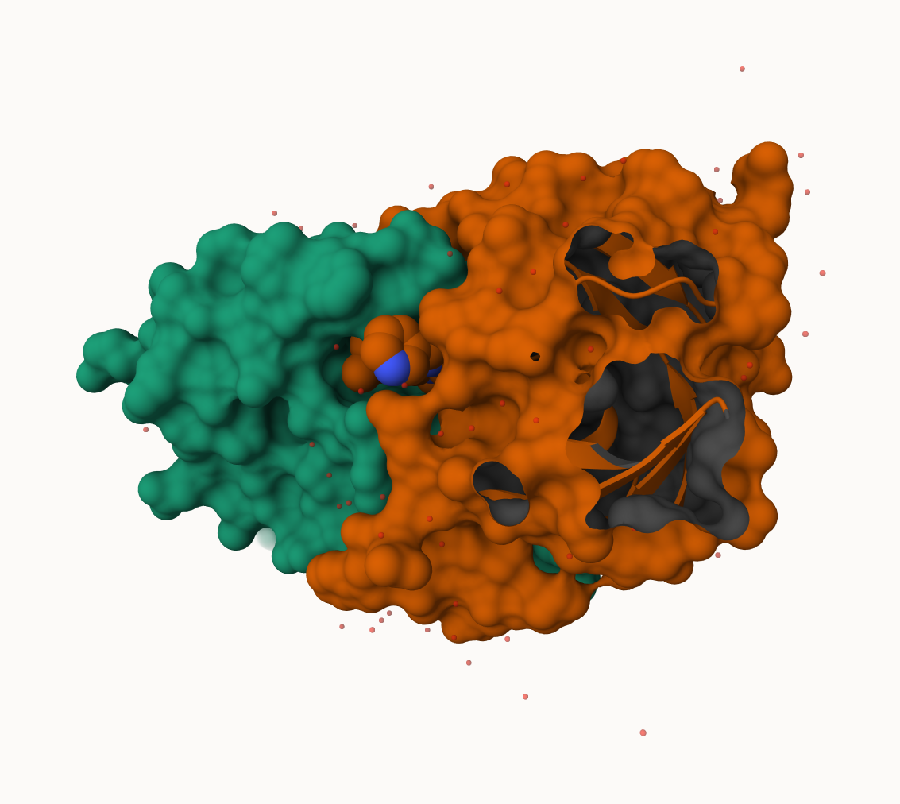
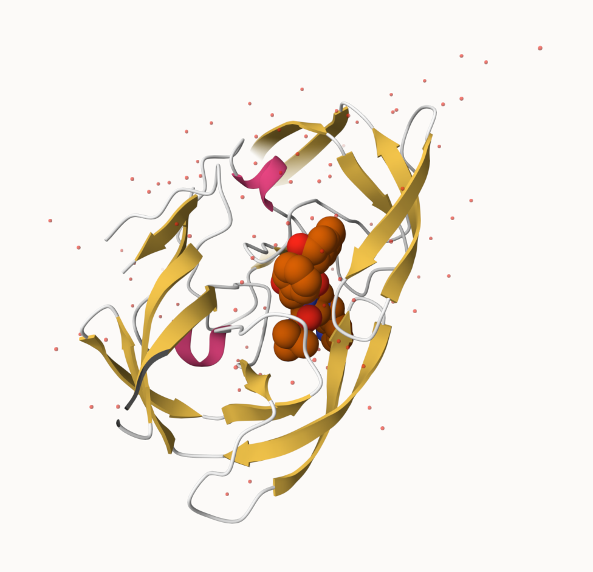
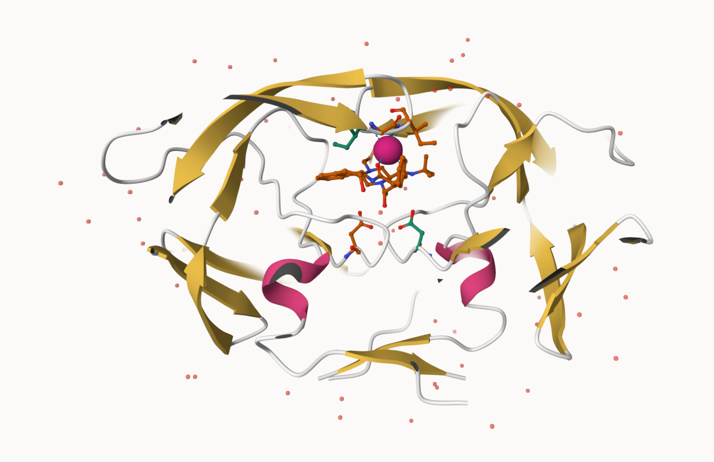

# Class 10: Structural Bioinformatics: Part 1
Nathan Joseph (PID: A17668656)

## The PDB database

The [Protein Data Bank (PDB)](http://www.rcsb.org/) is the main
repository of biomolecular structure data. Let’s see what is in it:

> Q1: What percentage of structures in the PDB are solved by X-Ray and
> Electron Microscopy?

80.9% structures in the PDB are solved by X-Ray and Electron Microscopy

> Q2: What proportion of structures in the PDB are protein?

85.97% of structures in the PDB are protein.

``` r
stats <- read.csv("pdb_stats.csv", row.names = 1)
#stats
```

``` r
#n.sums <- colSums(stats) # sum value for each column of the df
#round((n.sums/n.sums['Total'] * 100), digits=2)
```

``` r
#round(stats["Protein (only)",]$Total/n.sums['Total'] * 100, digits=2)
```

> What is the total number of the entries in the PDB?

``` r
#n.sums['Total']
```

## Using Molstar

We can use the main [Molstar viewer
online](https://molstar.org/viewer/):



> Q. Generate and insert an image of the HIV-Pr cartoon colored by
> secondary structure, showing the inhibitor (ligand) in spacefill.



> Q. Generate one final image showing catalytic APS 25 as ball and stick
> and the all-important active site water molecule as spacefill.



``` r
library(bio3d)

#hiv <- read.pdb("1HSG")
#hiv
```

``` r
#head(hiv$atom)
```

``` r
#pdbseq(hiv)
```

Let’s try out the new **bio3dview** package that is not yet on CRAN. We
can use the **remotes** package to install any R package from Github.

### Quick viewing of PDBs

``` r
library(bio3dview)
library(bio3d)

#sele <- atom.select(hiv, resno=25)

#view.pdb(hiv, backgroundColor="pink", highlight=sele, highlight.style="vdw")
```

### Prediction of Protein flexibility

``` r
#adk <- read.pdb("6s36")
#m <- nma(adk)

#plot(m)
```

Write out our results as a wee trajectory movie:

``` r
#mktrj(m, file="results.pdb")
```

``` r
#view.nma(m)
```

## Comparative protein structure analysis with PCA

We start with a database id “1ake_A”

``` r
library(bio3d)
id <- "1ake_A"
#aa <- get.seq(id)
```

``` r
#blast <- blast.pdb(aa)
```

Have a wee peek:

``` r
#head(blast$hit.tbl)
```

``` r
#hits <- plot(blast)
```

Peak at our “top hits”

``` r
#head(hits$pdb.id)
```

Now we can download these “top hits” and these will all be ADK (this is
the name of the protein family)

``` r
#files <-get.pdb(hits$pdb.id, path = "pdbs", split=T, gzip=T)
```

We need one package from BioConductor. To set this up we need to first
install a package called **“BiocManager”** from CRAN.

Now we can use the `install()` function from this package like this:
`BiocManager::install("msa")`

``` r
#pdbs <- pdbaln(files, fit=T, exefile="msa")
```

Let’s have a week peak at our structures after “fitting” or superposing:

``` r
library(bio3dview)
#view.pdbs(pdbs)
```

``` r
#view.pdbs(pdbs, colorScheme = "residue")
```

We can run functions like `rmsd()`, `rmsf()` and the best `pca()`

``` r
#pc.xray <- pca(pdbs)
#plot(pc.xray)
```

``` r
#plot(pc.xray, 1:2)
```

Finally, let’s make a wee movie of the major “motion” or structural
difference in the dataset - we call this a “trajectory”

``` r
#mktrj(pc.xray, file="results.pdb")
```
