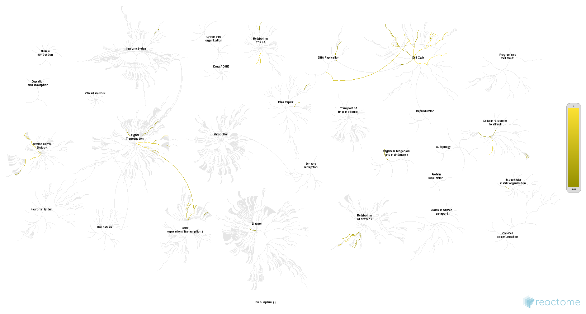

## Background

The data for today's mini-project comes from a knock-down study of an important HOX gene.
Specifically, it comes from GEO entry: GSE37704, which is associated with the following publication:

"Trapnell C, Hendrickson DG, Sauvageau M, Goff L et al. "Differential analysis of gene regulation at transcript resolution with RNA-seq". Nat Biotechnol 2013 Jan;31(1):46-53. PMID: 23222703"

The authors report on differential analysis of lung fibroblasts in response to loss of the developmental transcription factor HOXA1. Their results and others indicate that HOXA1 is required for lung fibroblast and HeLa cell cycle progression. In particular their analysis show that "loss of HOXA1 results in significant expression level changes in thousands of individual transcripts, along with isoform switching events in key regulators of the cell cycle

## Data Import

```{r}
countData <- read.csv("GSE37704_featurecounts.csv", row.names = 1)
colData <- read.csv("GSE37704_metadata.csv", row.names = 1)
```

```{r}
head(countData)
```

```{r}
head(colData)
```


### Clean up (data tidying)

```{r}
countData <- as.matrix(countData[,-1])
head(countData)
```

```{r}
colnames(countData) == rownames(colData)
```


```{r}
countData = countData[, ]
head(countData)
```

```{r}
countData = countData[rowSums(countData)>0, ]
head(countData)
```

## DESeq Analysis

```{r, message = FALSE}
library(DESeq2)
```


### Setting up the DESeq object

```{r}
dds <- DESeqDataSetFromMatrix(countData=countData,
                             colData=colData,
                             design=~condition)
```

### Running DESeq

```{r}
dds <- DESeq(dds)
dds
```


### Getting results

```{r}
res <- results(dds)
summary(res)
```

## Volcano plot

```{r}
library(ggplot2)

ggplot(res) +
  aes(log2FoldChange, 
      -log2(padj)) +
  geom_point()
```


```{r}
# Make a color vector for all genes
mycols <- rep("gray", nrow(res))

# Color blue the genes with fold change above 2
mycols[ abs(res$log2FoldChange) > 2 ] <- "blue"

# Color gray those with adjusted p-value more than 0.01
mycols[ res$padj > 0.01 ] <- "gray"

ggplot(res) +
  aes(log2FoldChange, 
      -log2(padj)) +
  geom_point(col = mycols) +
  xlab("Log2(FoldChange)") +
  ylab("-Log(P-value)") +
  geom_vline(xintercept = c(-2,2),  color="black") +
  geom_hline(yintercept = -log10(0.01), color="black")
```


## Add Annotation

```{r}
library("AnnotationDbi")
library("org.Hs.eg.db")

columns(org.Hs.eg.db)

res$symbol = mapIds(org.Hs.eg.db,
                    keys=rownames(res), 
                    keytype="ENSEMBL",
                    column="SYMBOL",
                    multiVals="first")

res$entrez = mapIds(org.Hs.eg.db,
                    keys=rownames(res),
                    keytype="ENSEMBL",
                    column="ENTREZID",
                    multiVals="first")

res$name =   mapIds(org.Hs.eg.db,
                    keys=row.names(res),
                    keytype="ENSEMBL",
                    column="GENENAME",
                    multiVals="first")

head(res, 10)
```

```{r}
res = res[order(res$pvalue),]
write.csv(res, file="deseq_results.csv")
```


## Pathway Analysis

We're going to use the `gage` package for pathway analysis

### KEGG

```{r}
library(pathview)
library(gage)
library(gageData)

data(kegg.sets.hs)
data(sigmet.idx.hs)

# Focus on signaling and metabolic pathways only
kegg.sets.hs = kegg.sets.hs[sigmet.idx.hs]
```

```{r}
foldchanges = res$log2FoldChange
names(foldchanges) = res$entrez
head(foldchanges)
```

```{r}
keggres = gage(foldchanges, gsets=kegg.sets.hs)
```

```{r}
attributes(keggres)
```

```{r}
head(keggres$less)
```

```{r}
pathview(gene.data=foldchanges, pathway.id="hsa04110")
```


A PDF based graph:

```{r}
pathview(gene.data=foldchanges, pathway.id="hsa04110", kegg.native=FALSE)
```

```{r}
keggrespathways <- rownames(keggres$greater)[1:5]

# Extract the 8 character long IDs part of each string
keggresids = substr(keggrespathways, start=1, stop=8)
keggresids
```

```{r}
pathview(gene.data=foldchanges, pathway.id=keggresids, species="hsa")
```


### GO

```{r}
data(go.sets.hs)
data(go.subs.hs)

# Focus on Biological Process subset of GO
gobpsets = go.sets.hs[go.subs.hs$BP]

gobpres = gage(foldchanges, gsets=gobpsets)

lapply(gobpres, head)
```


### Reactome

```{r}
sig_genes <- res[res$padj <= 0.05 & !is.na(res$padj), "symbol"]
print(paste("Total number of significant genes:", length(sig_genes)))
```

```{r}
write.table(sig_genes, file="significant_genes.txt", row.names=FALSE, col.names=FALSE, quote=FALSE)
```



> Q: What pathway has the most significant “Entities p-value”? Do the most significant pathways listed match your previous KEGG results? What factors could cause differences between the two methods?

The mitotic cell cycle has the most significant "Entities p-value". The most significant pathways so match my previous KEGG results. Factors that could cause differences between the two methods would be differences in prioritizations of different pathways and also the scope of how many pathways are accessible to each method, which would both affect the p-value.


